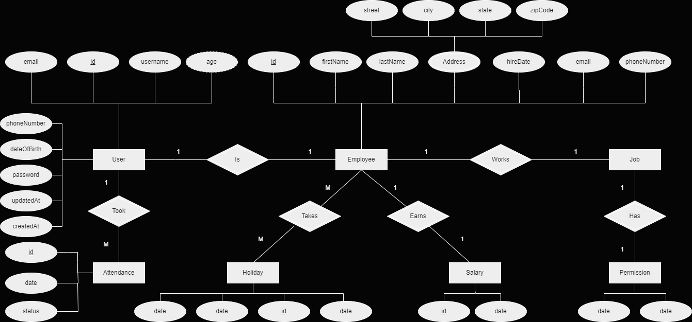

# EmployeeManagementSystem
Employee Managament System using Spring MVC

## ER Diagram (Chen Notation)

## Features
- **Models and Relations**: Defined entities and their relationships using JPA annotations and Hibernate.
- **Spring Data JPA**: Utilized Spring Data JPA for repository management and database interactions.
- **Spring Security 6.3**: Implemented authentication, authorization, and JWT for securing the application.
- **MockMVC and JUnit**: Used MockMVC for testing the REST controllers and JUnit for unit testing.
- **Spring DTO**: Used Spring DTOs for efficient data transfer between the client and server.

## Future Enhancements
- **Microservices Architecture**: The project will be transformed into a microservice architecture later on, enabling better scalability and modularity
- **Role-Based Access Control (RBAC)**: Implemented RBAC to manage access within the system. 
  - **READ**: Read requests ONLY.
  - **WRITE**: All types of requests but limited to some.
  - **FULL_ACCESS**: Admin role
 
## Future Enhancements
- **Microservices Architecture**: The project will be transformed into a microservice architecture later on, enabling better scalability and modularity.
